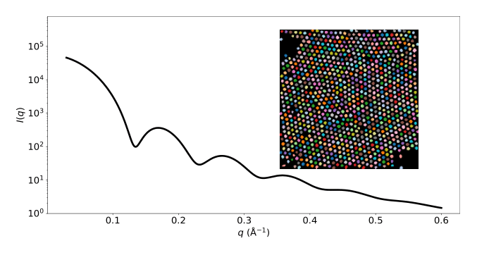

# i2sas

<p style="text-align:center;">
    
</p>

Calculating Small-Angle Scattering Intensity Functions from Electron Microscopy Images

## Usage

A demonstration of the full pipeline for calculating a small-angle scattering intensity function from an electron microscopy image can be found in `i2sas.ipynb`.

#### 1. Clone the repository

Clone and move into the `i2sas` directory:

    $ git clone https://github.com/by256/i2sas.git
    $ cd i2sas

#### 2. Create a virtual environment

Create and activate a virtual environment. With `conda`, this would be:


    $ conda create -n i2sas python=3.8
    $ conda activate i2sas

#### 3. Install requirements

Install the requirements in the virtual environment you just created and activated:

    $ python -m pip install -r requirements.txt

#### 4. Run the notebook

Then simply open `i2sas.ipynb` with Jupyter Notebook and run all the cells. This should reproduce the results found in Figure 1 and Figure 3 of the paper.

## Citing

If you use the methods outlined in this repository, please cite the following work:

```
@article{i2sas,
    author = "Yildirim, Batuhan and Washington, Adam and Doutch, James and Cole, Jacqueline M.",
    title = "Calculating Small-Angle Scattering Intensity Functions from Electron-Microscopy images",
    journal = "RSC Adv.",
    year = "2022",
    volume = "12",
    issue = "26",
    pages = "16656-16662",
    publisher = "The Royal Society of Chemistry",
    doi = "10.1039/D2RA00685E",
    url = "http://dx.doi.org/10.1039/D2RA00685E",
}
```

## Funding

This project was financially supported by the [Science and Technology Facilities Council (STFC)](https://stfc.ukri.org/) and the [Royal Academy of Engineering](https://www.raeng.org.uk/) (RCSRF1819\7\10).


## License

[](http://badges.mit-license.org)